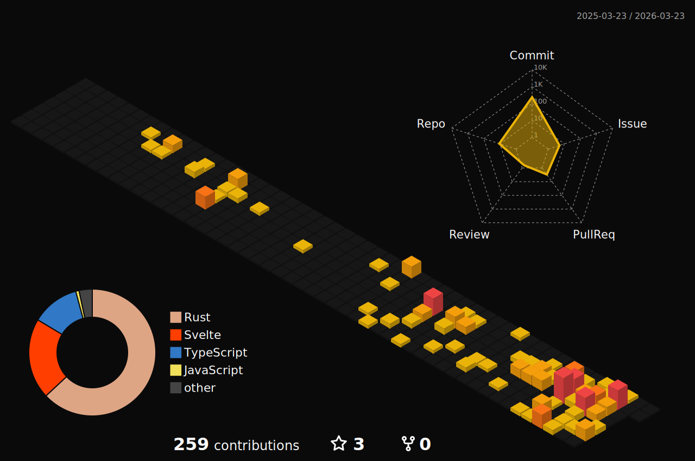

# RoyalFoxy

I primarily use Rust and TypeScript. I'm very opiniated:

- A project must have solid linting
- There is no excuse for using `.unwrap()`, do it differently and explain why.
- AI is worse than me.

